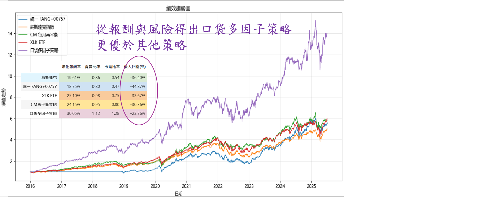

# US Market Rebalancing Strategy — 美股再平衡策略

本專案展示一個基於美股市場的再平衡策略，透過嚴謹的資料處理、回測與風控分析，驗證策略在不同週期（每日 / 每月 / 每季）的表現。

---

## 📊 策略特色
- **多週期回測**：分析每日、每月、每季的再平衡效果，評估策略在不同調整頻率下的績效。
- **含交易成本**：回測結果納入手續費與交易成本，更貼近真實情境。
- **換手率分析**：統計年度買進/賣出次數與平均換手率，衡量策略穩定性與交易成本影響。
- **持倉配置視覺化**：以圖表呈現投資組合的權重變化，直觀展示再平衡過程。
- **蒙地卡羅模擬**：透過隨機抽樣與多次模擬，驗證策略在不同市場狀況下的穩健性。

---

## 📈 績效展示
（比較多口袋因子策略(multifactor)、納斯達克QQQ、CM每月再平衡、XLKETF，例如 NAV 曲線、Sharpe Ratio、MDD、等）

口袋多因子策略   = 我研發的多因子美股策略成為公司的主力策略之一


CM每月再平衡策略 = QQQrotation(這裡為每月再平衡)




---

## ⚙️ 技術架構

- **資料處理**：Python (Pandas, NumPy)  
- **回測框架**：因子排序 + 事件驅動架構，含交易成本與停損模組  
- **模擬方法**：蒙地卡羅模擬、Bootstrap 驗證  
- **視覺化**：Matplotlib、Plotly  

**Libraries**: Pandas, NumPy, Matplotlib, SQLAlchemy, tqdm  
**Database**: PostgreSQL（可改為 CSV 範例資料）  

**Workflow**:
1. 連接資料庫或讀取 CSV  
2. 建立量化策略（因子計算、分組回測）  
3. 計算績效指標（CAGR, Sharpe, MDD, Turnover）  
4. 輸出 NAV 曲線圖至 `images/`  

## 📂 專案結構

QQQ_rotation/
│
├── README.md                # 專案介紹（策略說明、績效展示）
├── requirements.txt         # 相依套件清單 (pandas, numpy, matplotlib, sqlalchemy, tqdm)
│
├── src/                     # 核心程式碼
│   └── qqq_rotation.py      # 主程式（已去敏 DB_URI，需自行修改）
│
├── notebooks/               # Jupyter Notebook Demo
│   └── strategy_demo.ipynb  # 簡化範例，展示回測流程
│
├── data/                    # 範例資料（僅用於 demo，不含公司資料）
│   ├── price.csv
│   ├── market_cap.csv
│   └── etf_holdings.csv
│
└── images/                  # 成果圖
    └── nav_vs_benchmark.png

## 🚀 How to Run

此專案支援 **兩種資料來源**：  
1. **PostgreSQL 資料庫**（適合有金融資料庫的使用者）  
2. **CSV 範例資料**（適合沒有資料庫，只想跑 demo 的使用者）
3. 
### 安裝環境
```bash
pip install -r requirements.txt

---


